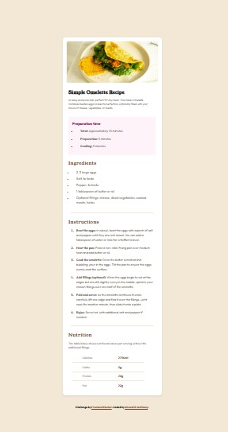
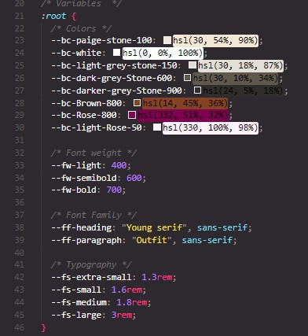
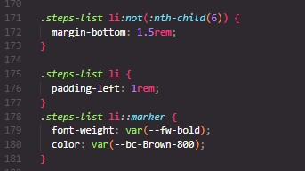

# Frontend Mentor - Recipe page solution

This is a solution to the [Recipe page challenge on Frontend Mentor](https://www.frontendmentor.io/challenges/recipe-page-KiTsR8QQKm). Frontend Mentor challenges help you improve your coding skills by building realistic projects.

## Table of contents

- [Screenshot](#screenshot)
- [Links](#links)
- [Built with](#built-with)
- [What I learned](#what-i-learned)
- [Author](#author)

### Screenshot



### Links

- Solution URL: [Add solution URL here](https://your-solution-url.com)
- Live Site URL: [Add live site URL here](https://your-live-site-url.com)

### Built with

- Semantic HTML5 markup
- CSS custom properties
- Flexbox
- Mobile-first workflow

### What I learned

I learned how to make a variables that can be used throughout the design to avoid repeating the same code over and over, and also i knew that there were another way to build this project using (CSS Grid), but i will try it later


I also learned how to manipulate the bullet points of the ordered or unordered list using (::marker) pseudo-element


```

## Author

- Frontend Mentor - [@Ahmed-Nafrawy](https://www.frontendmentor.io/profile/Ahmed-Nafrawy)
```
